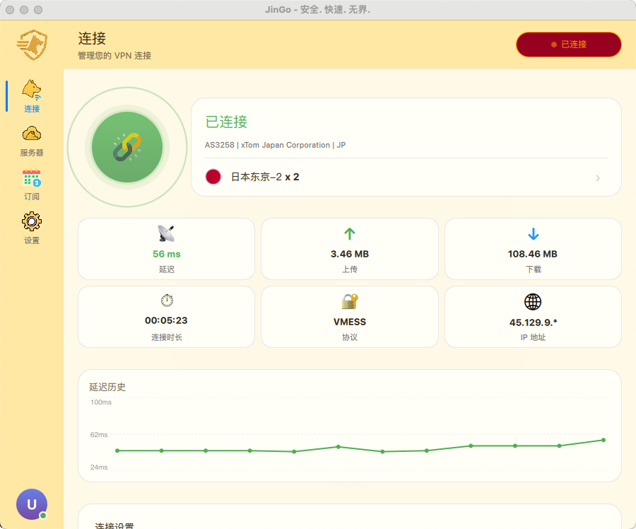

# JinGo VPN

[中文](README_zh.md)

Cross-platform VPN client built with Qt 6 and Xray core.

## Features

- **Cross-platform**: Android, iOS, macOS, Windows, Linux
- **Modern UI**: Smooth user interface built with Qt 6 QML
- **Multi-protocol**: Based on Xray core, supports VMess, VLESS, Trojan, Shadowsocks, etc.
- **Multi-language**: Supports 8 languages (English, Chinese, Vietnamese, Khmer, Burmese, Russian, Persian, etc.)
- **White-labeling**: Supports brand customization and multi-tenant deployment

## Screenshots

<p align="center">
  
  
  
</p>

<p align="center">
  
  
</p>

## Table of Contents

- [Features](#features)
- [Screenshots](#screenshots)
- [Quick Start](#quick-start)
- [Platform Support](#platform-support)
- [Documentation](#documentation)
- [Language Support](#language-support)
- [Tech Stack](#tech-stack)
- [Build Options](#build-options)
- [Development](#development)
- [Contact](#contact)
- [License](#license)

## Quick Start

### Prerequisites

- **Qt**: 6.10.0+ (recommended 6.10.0 or higher)
- **CMake**: 3.21+
- **Compiler**:
  - macOS/iOS: Xcode 15+
  - Android: NDK 27.2+
  - Windows: MinGW 13+ or Visual Studio 2022
  - Linux: GCC 11+ or Clang 14+

### Build Steps

#### 1. Fork and Configure White-label

```bash
# 1. Fork this repository to your GitHub account

# 2. Clone your fork
git clone https://github.com/YOUR_USERNAME/JinGo.git
cd JinGo

# 3. Create your white-label config
cp -r white-labeling/1 white-labeling/YOUR_BRAND

# 4. Edit white-labeling/YOUR_BRAND/bundle_config.json
{
    "panel_url": "https://your-api-server.com",
    "app_name": "YourApp",
    "support_email": "support@your-domain.com",
    ...
}

# 5. Replace app icons in white-labeling/YOUR_BRAND/icons/
```

#### 2. Build Application

All build scripts are in `scripts/build/`:

```bash
# Android APK
./scripts/build/build-android.sh --release --abi arm64-v8a

# macOS App (Universal Binary: arm64 + x86_64)
./scripts/build/build-macos.sh --release

# iOS App (requires Apple Developer Team ID)
./scripts/build/build-ios.sh --release --team-id YOUR_TEAM_ID

# Linux
./scripts/build/build-linux.sh --release

# Windows (PowerShell)
.\scripts\build\build-windows.ps1
```

#### 3. Build with White-label Brand

```bash
./scripts/build/build-macos.sh --release --brand YOUR_BRAND
./scripts/build/build-android.sh --release --brand YOUR_BRAND
./scripts/build/build-ios.sh --release --brand YOUR_BRAND --team-id YOUR_TEAM_ID
```

### Output Locations

| Platform | Output | Location |
|----------|--------|----------|
| Android | APK | `release/jingo-*-android.apk` |
| macOS | DMG | `release/jingo-*-macos.dmg` |
| iOS | IPA | `release/jingo-*-ios.ipa` |
| Windows | EXE/MSI | `release/jingo-*-windows.exe` |
| Linux | tar.gz | `release/jingo-*-linux.tar.gz` |

## Platform Support

| Platform | Architecture | Minimum Version | Status |
|----------|--------------|-----------------|--------|
| Android | arm64-v8a, armeabi-v7a, x86_64 | API 28 (Android 9) | ✅ |
| iOS | arm64 | iOS 15.0 | ✅ |
| macOS | arm64, x86_64 | macOS 12.0 | ✅ |
| Windows | x64 | Windows 10 | ✅ |
| Linux | x64 | Ubuntu 20.04+ | ✅ |

## Documentation

- [Architecture](docs/01_ARCHITECTURE.md)
- [Build Guide](docs/02_BUILD_GUIDE.md)
- [Development Guide](docs/03_DEVELOPMENT.md)
- [White-labeling](docs/04_WHITE_LABELING.md)
- [Troubleshooting](docs/05_TROUBLESHOOTING.md)
- [Platform Guide](docs/06_PLATFORMS.md)
- [Panel Extension](docs/07_PANEL_EXTENSION.md)

## Language Support

| Language | Code | Status |
|----------|------|--------|
| English | en_US | ✅ |
| Simplified Chinese | zh_CN | ✅ |
| Traditional Chinese | zh_TW | ✅ |
| Vietnamese | vi_VN | ✅ |
| Khmer | km_KH | ✅ |
| Burmese | my_MM | ✅ |
| Russian | ru_RU | ✅ |
| Persian | fa_IR | ✅ |

## Tech Stack

- **UI Framework**: Qt 6.10.0+ (QML/Quick)
- **VPN Core**: Xray-core (via SuperRay wrapper)
- **Network**: Qt Network + OpenSSL
- **Storage**: SQLite (Qt SQL)
- **Secure Storage**:
  - macOS/iOS: Keychain
  - Android: EncryptedSharedPreferences
  - Windows: DPAPI
  - Linux: libsecret

## Build Options

### CMake Options

| Option | Default | Description |
|--------|---------|-------------|
| `USE_JINDO_LIB` | ON | Use JinDoCore static library |
| `JINDO_ROOT` | `../JinDo` | JinDo project path |
| `CMAKE_BUILD_TYPE` | Debug | Build type (Debug/Release) |

### Build Script Options

```bash
# Common options
--clean          # Clean build directory
--release        # Release mode
--debug          # Debug mode

# Android specific
--abi <ABI>      # Architecture (arm64-v8a/armeabi-v7a/x86_64/all)
--sign           # Sign APK

# macOS specific
--sign           # Enable code signing (requires Team ID)
--team-id ID     # Apple Development Team ID

# iOS specific (signing required)
--team-id ID     # Apple Development Team ID (required)

# Linux specific
--deploy         # Deploy Qt dependencies
--package        # Create installation package
```

## Development

### Code Style

- C++17 standard
- Qt coding conventions
- Use `clang-format` for formatting

### Debugging

```bash
# Enable verbose logging
QT_LOGGING_RULES="*.debug=true" ./JinGo

# Android logcat
adb logcat -s JinGo:V SuperRay-JNI:V
```

## Contact

- Telegram Channel: [@OpineWorkPublish](https://t.me/OpineWorkPublish)
- Telegram Group: [@OpineWorkOfficial](https://t.me/OpineWorkOfficial)

## License

MIT License

---

**Version**: 1.0.0
**Qt Version**: 6.10.0+
**Last Updated**: 2026-01
